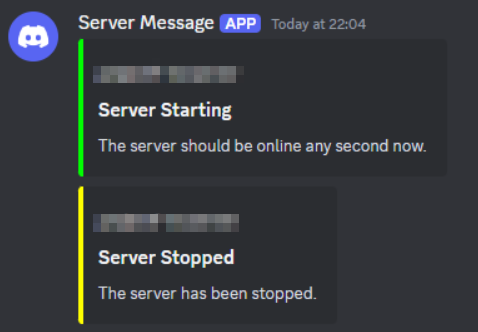
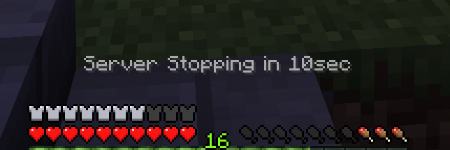
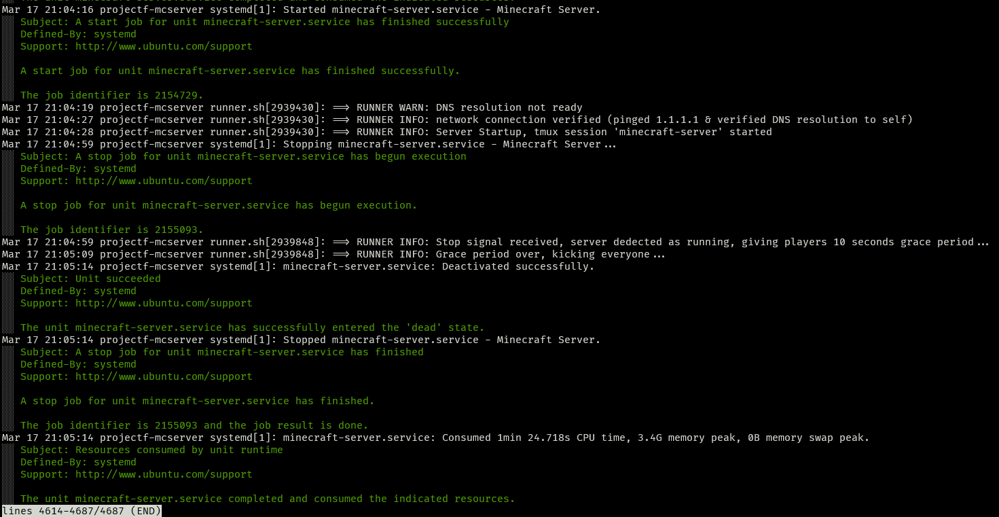

# Minecraft Dedicated Server

This folder contains a collection of files / custom scripts
I use when hosting a Minecraft server.

I prefer to have things lightweight without sacrificing on
functionality, maintainability or usability.
These scripts are my approach at a dynamic solution 
which can meet all needs.

## Features

### Alerting

- Webhook support
- In game alerts pre-shutdown or potential out of RAM issues.





### Self Management / Recovery

These scripts are designed to run using systemd to keep everything alive,
that said, the scripts are designed to:

- Ensures the server is running and attempts restarting before giving up.
- Prevents out of memory issues;
  *stops and restarts the server before system RAM runs out*

### Logging

As mentioned earlier, the server is kept alive using systemd, the sript's logging
can thus be found in that log `sudo journalctl -xue minecraft-server.service`
or running `sudo systemctl status minecraft-server`, to see the latest logs
alongside the status of the system service.



## Setup Guide

These scripts should work for both vanilla or modded minecraft.

### Setting up the environment

**1.** Ensure your system is up to date

```shell
# Debian-based systems
sudo apt update && sudo apt upgrade

# RHEL-based systems
sudo dnf update
```

**2.** Create the minecraft user

```shell
sudo useradd -m -d /opt/minecraft-server -s /bin/bash minecraft
```

- `-m` creates the home directory if it doesn't exist.
- `-d` specifies that /opt/minecraft-server should be the home directory
- `-s` set the login shell

By default, because no password was set, the `minecraft` login cannot log in directly with a password.
This is intended, for added security. However, if you find that the user minecraft does have a password or you temporarily set one, you can delete any password set for the `minecraft` user with the following command:

```shell
sudo passwd -d minecraft
```

**3.** Install Java

> [!NOTE]
> It is recommended to always check which version of java best works with the minecraft version you're installing.

Replace the version number with the version you need.

```shell
# Debian-based systems
sudo apt install openjdk-21-jre

# RHEL-based systems
sudo dnf install java-21-openjdk
```

### Installing the server

**1.** Switch to the minecraft user

```shell
sudo su - minecraft
```

**2.**

Download the minecradt: java edition server.  
https://www.minecraft.net/en-us/download/server

You can do so using wget, eg:
```shell
wget https://piston-data.mojang.com/v1/objects/e6ec2f64e6080b9b5d9b471b291c33cc7f509733/server.jar
```

WIP...

Sorry, I still have to finish writing this guide, it will be completed someday in the future.

```s
[Unit]
Description=Minecraft Server
After=network.target
StartLimitBurst=6
StartLimitIntervalSec=60

[Service]
User=minecraft
WorkingDirectory=/opt/minecraft
ExecStart=/opt/minecraft/runner.sh start
ExecStop=/opt/rminecraft/runner.sh stop
Restart=always
RestartSec=10
SuccessExitStatus=0

[Install]
WantedBy=multi-user.target
```
